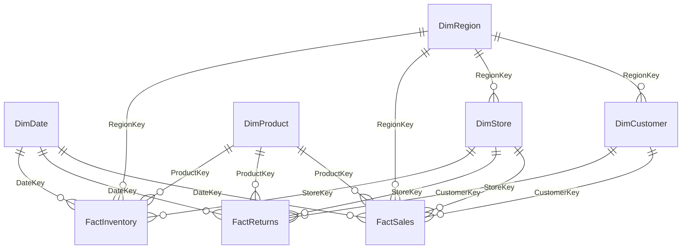

# Dataset Architecture

## Architecture Summary

The dataset is modeled as a retail enterprise star schema. Transactional activity is stored in three fact tables, while descriptive business context is stored in five dimensions.

## Fact Tables

| Table | Grain | Business Purpose |
|---|---|---|
| FactSales | One sales order line per product/customer/store/date | Measures revenue, units, discounts, cost, and profit. |
| FactReturns | One return transaction linked to an original sale | Measures refund value, returned units, and return reasons. |
| FactInventory | One inventory snapshot per product/store/date | Measures stock health, demand proxy, replenishment, and operational risk. |

## Dimension Tables

| Table | Purpose |
|---|---|
| DimCustomer | Customer demographics, CRM segment, loyalty tier, and geographic home region. |
| DimProduct | Product hierarchy, brand, price, cost, launch date, and discontinued status. |
| DimStore | Store attributes, channel, manager, store format, and operating status. |
| DimRegion | Executive geography, market tier, territory, and accountable regional manager. |
| DimDate | Calendar attributes needed for trend, YoY, MoM, and fiscal reporting. |

## ER Diagram

See `Images/er_diagram.mmd` and `Images/er_diagram.svg`.

## Relationship Explanation

- `FactSales` connects to all conformed dimensions: Date, Customer, Product, Store, and Region. This supports executive slicing without needing report-layer joins.
- `FactReturns` connects to the original sale through `SalesKey` and also carries core dimension keys for direct return analysis.
- `FactInventory` uses Date, Product, Store, and Region to analyze stock health and replenishment needs.
- `DimRegion` is shared by customers, stores, sales, and inventory. This makes regional performance consistent across sales, profitability, retention, and operations.
- Relationships in Power BI should be one-to-many from dimension to fact with single filter direction from dimension to fact.

## Primary and Foreign Keys

The complete column-level key map is available in `Dataset/data_dictionary.md`.
